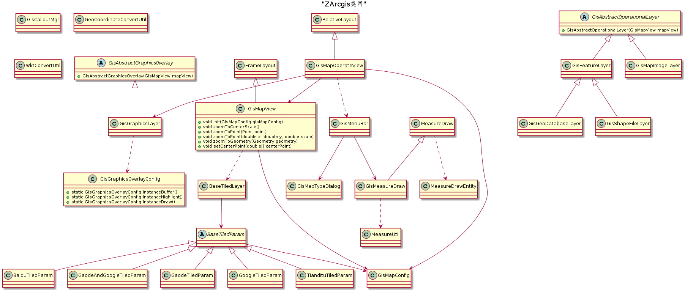

ZArcgis
=
> 封装arcgis的的主要操作，基于arcgis100.3.0版本。

Feature
-
1. 加载底图无缝切换，可以加载天地图、google、百度、高德底图。
1. 底图可以进行本地缓存。
1. 实现图层基本操作，如点、线、面、文字、图片等绘制。
1. 实现图层基本查询，如id、关键字、范围等要素查询。
1. 封装绘画图层（GraphicsOverlay）、业务图层（OperationalLayer)及其扩展类，可以方便的进行二次扩展。
1. 提供底图展示及查询的组合组件，GisMapView。
1. 提供GisMapView的封装类GisMapOperateView，提供基本工具条（GisMenuBar）如图层切换、缓存图层清理、测距、测面、定位等功能。
1. 提供坐标系转换（GeoCoordinateConvertUtil），wkt转换（WktConvertUtil）等工具类。
1. 提供底图基本参数设置（GisMapConfig）如坐标系、中心点坐标、底图参数、缓存底图、缓存路径等底图配置。
1. 提供Callout管理类（GisCalloutMgr），管理地图的Callout。

Gradle
-
```
    implementation "com.android.support:appcompat-v7:你的版本号"
    implementation 'com.github.zcolin:ZArcgis:latest.release'
```

class structure
-


USAGE
-
**layout**
```
    <com.telchina.arcgis.core.GisMapOperateView
        android:id="@+id/gismap_view"
        xmlns:android="http://schemas.android.com/apk/res/android"
        xmlns:app="http://schemas.android.com/apk/res-auto"
        android:layout_width="match_parent"
        android:layout_height="match_parent"
        app:menuBarGravity="right_top"
        app:menuBarOrientation="vertical"
        app:clearIcon="@drawable/ic_launcher"
        app:locationIcon="@drawable/ic_launcher"
        app:mapTypeIcon="@drawable/ic_launcher"
        app:resetIcon="@drawable/ic_launcher"
        app:measureToolVisibility="visible"
        app:menuBarPaddingLeft="5dp"
        app:mapTypeItemTextColor="@android:color/white"
        >
```

**Code**
```
    GisMapOperateView gisMapOperateView = findViewById(R.id.gismap_view);
    gisMapOperateView.initMapViews();
    GisCalloutMgr.instance(gisMapOperateView.getCallout(), mActivity, "我是一个callout")
                 .backgroundColor(Color.GREEN)
                 .borderColor(Color.RED)
                 .outSideTouchDismiss(gisMapOperateView.getGisMapView())
                 .show(gisMapOperateView.getMapCenterPoint());
    
    gisMapOperateView.drawText(gisMapOperateView.getMapCenterPoint(), "我是绘制的文字");
    gisMapOperateView.drawPictureMarker(gisMapOperateView.getMapCenterPoint(), getResources().getDrawable(R.drawable.ic_launcher));
    gisMapOperateView.getGraphicsLayerMgr().bufferGeometry(gisMapOperateView.getMapCenterPoint(), GisGraphicsOverlayConfig.instanceBuffer(), 5000);
    
    //对应原来的DynamicLayer
    GisMapImageLayer layerMgr = new GisMapImageLayer(gisMapOperateView.getGisMapView());
    layerMgr.addMapImageLayer("key","http://url");
    layerMgr.getFeatureByPoint(ArcGISMapImageSublayer, Point, 500);
    layerMgr.getFeatureResultLike(ArcGISMapImageSublayer, "key", "word");
```